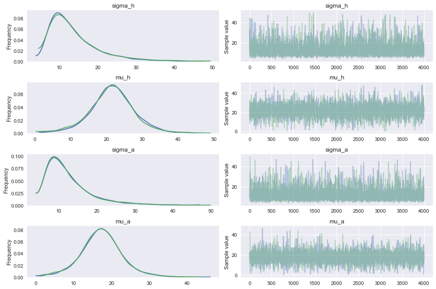
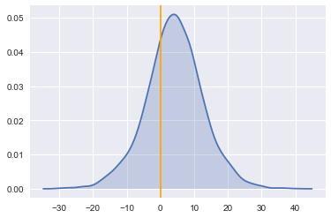

# Data Collection 


```
import pandas as pd
import seaborn as sns
import pymc3 as pm
import numpy as np
import matplotlib
import matplotlib.pyplot as plt
%matplotlib inline
```


```
x1 = pd.ExcelFile('../data/2017_nfl_scores.xls')  
df = x1.parse("Sheet1", header = None, usecols = [1,2,3,4])
# Rename columns 
df.columns = ['Date', 'Home', 'Away', 'Score']
# drop and NaN rows
df.dropna(axis=0, how='any', inplace =True )
```


```
df.head()
```


<div>
<table border="1" class="dataframe">
  <thead>
    <tr style="text-align: right;">
      <th></th>
      <th>Date</th>
      <th>Home</th>
      <th>Away</th>
      <th>Score</th>
    </tr>
  </thead>
  <tbody>
    <tr>
      <th>0</th>
      <td>04.12. 17:30</td>
      <td>Cincinnati Bengals</td>
      <td>Pittsburgh Steelers</td>
      <td>20 : 23</td>
    </tr>
    <tr>
      <th>1</th>
      <td>03.12. 17:30</td>
      <td>Seattle Seahawks</td>
      <td>Philadelphia Eagles</td>
      <td>24 : 10</td>
    </tr>
    <tr>
      <th>2</th>
      <td>03.12. 13:25</td>
      <td>Arizona Cardinals</td>
      <td>Los Angeles Rams</td>
      <td>16 : 32</td>
    </tr>
    <tr>
      <th>3</th>
      <td>03.12. 13:25</td>
      <td>New Orleans Saints</td>
      <td>Carolina Panthers</td>
      <td>31 : 21</td>
    </tr>
    <tr>
      <th>4</th>
      <td>03.12. 13:25</td>
      <td>Oakland Raiders</td>
      <td>New York Giants</td>
      <td>24 : 17</td>
    </tr>
  </tbody>
</table>
</div>


```
# Split scores into away and home and drop Score column 
df['home_score'] = df.Score.str.split(':').str.get(0).astype(int)
df['away_score'] = df.Score.str.split(':').str.get(1).astype(int)
df.drop('Score', inplace=True, axis=1)
```


```
df.head()
```


<div>
<table border="1" class="dataframe">
  <thead>
    <tr style="text-align: right;">
      <th></th>
      <th>Date</th>
      <th>Home</th>
      <th>Away</th>
      <th>home_score</th>
      <th>away_score</th>
    </tr>
  </thead>
  <tbody>
    <tr>
      <th>0</th>
      <td>04.12. 17:30</td>
      <td>Cincinnati Bengals</td>
      <td>Pittsburgh Steelers</td>
      <td>20</td>
      <td>23</td>
    </tr>
    <tr>
      <th>1</th>
      <td>03.12. 17:30</td>
      <td>Seattle Seahawks</td>
      <td>Philadelphia Eagles</td>
      <td>24</td>
      <td>10</td>
    </tr>
    <tr>
      <th>2</th>
      <td>03.12. 13:25</td>
      <td>Arizona Cardinals</td>
      <td>Los Angeles Rams</td>
      <td>16</td>
      <td>32</td>
    </tr>
    <tr>
      <th>3</th>
      <td>03.12. 13:25</td>
      <td>New Orleans Saints</td>
      <td>Carolina Panthers</td>
      <td>31</td>
      <td>21</td>
    </tr>
    <tr>
      <th>4</th>
      <td>03.12. 13:25</td>
      <td>Oakland Raiders</td>
      <td>New York Giants</td>
      <td>24</td>
      <td>17</td>
    </tr>
  </tbody>
</table>
</div>


```
# group by mean of home and away scores 
df.set_index('Home').groupby(level=0)['home_score'].agg({'avg home score': np.mean}).round(2).head()
```


<div>
<table border="1" class="dataframe">
  <thead>
    <tr style="text-align: right;">
      <th></th>
      <th>avg home score</th>
    </tr>
    <tr>
      <th>Home</th>
      <th></th>
    </tr>
  </thead>
  <tbody>
    <tr>
      <th>Arizona Cardinals</th>
      <td>22.00</td>
    </tr>
    <tr>
      <th>Atlanta Falcons</th>
      <td>23.00</td>
    </tr>
    <tr>
      <th>Baltimore Ravens</th>
      <td>27.33</td>
    </tr>
    <tr>
      <th>Buffalo Bills</th>
      <td>20.67</td>
    </tr>
    <tr>
      <th>Carolina Panthers</th>
      <td>22.00</td>
    </tr>
  </tbody>
</table>
</div>


```
df.set_index('Away').groupby(level=0)['away_score'].agg({'avg away score': np.mean}).round(2).head()
```


<div>
<table border="1" class="dataframe">
  <thead>
    <tr style="text-align: right;">
      <th></th>
      <th>avg away score</th>
    </tr>
    <tr>
      <th>Away</th>
      <th></th>
    </tr>
  </thead>
  <tbody>
    <tr>
      <th>Arizona Cardinals</th>
      <td>26.00</td>
    </tr>
    <tr>
      <th>Atlanta Falcons</th>
      <td>22.83</td>
    </tr>
    <tr>
      <th>Baltimore Ravens</th>
      <td>18.00</td>
    </tr>
    <tr>
      <th>Buffalo Bills</th>
      <td>24.00</td>
    </tr>
    <tr>
      <th>Carolina Panthers</th>
      <td>19.29</td>
    </tr>
  </tbody>
</table>
</div>


```
grouped = df.groupby('Home')
grouped.agg({'home_score': 'mean'}).round(2).head()

```


<div>
<table border="1" class="dataframe">
  <thead>
    <tr style="text-align: right;">
      <th></th>
      <th>home_score</th>
    </tr>
    <tr>
      <th>Home</th>
      <th></th>
    </tr>
  </thead>
  <tbody>
    <tr>
      <th>Arizona Cardinals</th>
      <td>22.00</td>
    </tr>
    <tr>
      <th>Atlanta Falcons</th>
      <td>23.00</td>
    </tr>
    <tr>
      <th>Baltimore Ravens</th>
      <td>27.33</td>
    </tr>
    <tr>
      <th>Buffalo Bills</th>
      <td>20.67</td>
    </tr>
    <tr>
      <th>Carolina Panthers</th>
      <td>22.00</td>
    </tr>
  </tbody>
</table>
</div>


```
# Write a class to contain team information
class Team:

    def __init__(self, home_score, away_score):
        self.home_score = home_score
        self.away_score = away_score

    def away_mean(self):
        return self.away_score.mean()

    def home_mean(self):
        return self.home_score.mean()

    def point_dif(self):
        return self.home_score.mean() - self.away_score.mean()
    
    def std_home(self):
        return np.std(self.home_score)
    
    def std_away(self):
        return np.std(self.away_score)
```


```
# Make a function to create a dictionary of Team classes by team name
def make_team_dict(city_names):
    # extract team names
    names = [team.split()[-1] for team in city_names]
    # build team dictionary
    team_dict = {}
    for name, long_names in zip(names, city_names):
        team_dict[name] = Team(df.loc[(df['Home'] == long_names), 'home_score'].values, df.loc[(
            df['Away'] == long_names), 'away_score'].values)
    return team_dict
```


```
nfl = make_team_dict(df.Home.unique())
```


```
 nfl['Dolphins'].home_score,  nfl['Dolphins'].away_score
```


    (array([35, 20, 24, 31, 16,  0]), array([17, 21,  0, 20,  6, 19]))


```
nfl['Patriots'].away_mean(), nfl['Dolphins'].home_mean()
```


    (29.333333333333332, 21.0)


```
nfl['Dolphins'].std_home(), nfl['Patriots'].std_home()
```


    (11.343133018115703, 5.6174331821175718)


# Model 
Come up with normal distribution for each team's home and away scores 


```
with pm.Model():
    # prior
    sigma_h = pm.Uniform('sigma_h', 0, 50) #dolphins home 
    mu_h = pm.Uniform('mu_h', 0, 50)
    
    sigma_a = pm.Uniform('sigma_a', 0, 50) # patriots away
    mu_a = pm.Uniform('mu_a', 0, 50)

    # likelihood
    H = pm.Normal('H', mu = mu_h, sd=sigma_h, observed=nfl['Chiefs'].home_score)
    A = pm.Normal('A', mu = mu_a, sd=sigma_a, observed=nfl['Raiders'].away_score)

    # Inference
    trace = pm.sample(4000, tune=500, njobs=2)
```

    Average Loss = 43.497:   2%|▏         | 3243/200000 [00:00<00:36, 5418.20it/s]
    100%|██████████| 4500/4500 [00:14<00:00, 306.69it/s]


```
pm.plots.plot_posterior(trace)
pm.traceplot(trace);
```





```
pm.summary(trace)
```

    
    sigma_h:
    
      Mean             SD               MC Error         95% HPD interval
      -------------------------------------------------------------------
      
      13.849           6.727            0.144            [4.986, 27.633]
    
      Posterior quantiles:
      2.5            25             50             75             97.5
      |--------------|==============|==============|--------------|
      
      6.153          9.190          12.025         16.503         32.134
    
    
    mu_h:
    
      Mean             SD               MC Error         95% HPD interval
      -------------------------------------------------------------------
      
      21.464           6.389            0.108            [7.639, 34.239]
    
      Posterior quantiles:
      2.5            25             50             75             97.5
      |--------------|==============|==============|--------------|
      
      7.933          17.780         21.510         25.165         34.690
    
    
    sigma_a:
    
      Mean             SD               MC Error         95% HPD interval
      -------------------------------------------------------------------
      
      12.488           6.159            0.115            [4.475, 25.181]
    
      Posterior quantiles:
      2.5            25             50             75             97.5
      |--------------|==============|==============|--------------|
      
      5.593          8.303          10.827         14.808         29.528
    
    
    mu_a:
    
      Mean             SD               MC Error         95% HPD interval
      -------------------------------------------------------------------
      
      17.357           5.590            0.088            [5.905, 29.332]
    
      Posterior quantiles:
      2.5            25             50             75             97.5
      |--------------|==============|==============|--------------|
      
      5.871          14.028         17.297         20.528         29.312
    


```
delta_distribution = trace['mu_h'] - trace['mu_a'] ; #subtracts the away from home

sns.kdeplot(delta_distribution, shade = True)
plt.axvline(0, color = 'orange');
```

    /Users/cristian/anaconda/lib/python3.6/site-packages/statsmodels/nonparametric/kdetools.py:20: VisibleDeprecationWarning: using a non-integer number instead of an integer will result in an error in the future
      y = X[:m/2+1] + np.r_[0,X[m/2+1:],0]*1j





```
print ( "Probability that Home team outscores Away team: %0.3f" % (delta_distribution > 0).mean())
```

    Probability that Home team outscores Away team: 0.704


Come up with a way to rank the highest probailities, and then incorporate the kelly criterion for bet value


```

```
