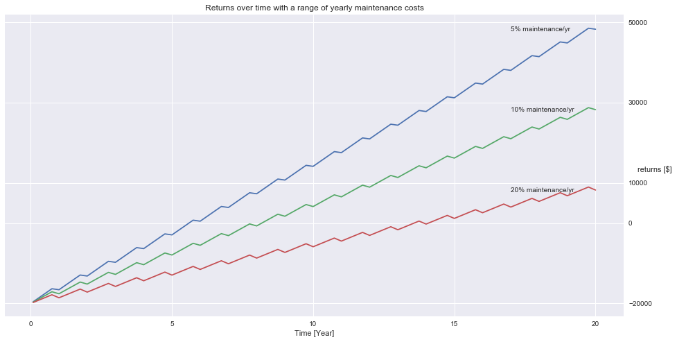

<h1>Table of Contents<span class="tocSkip"></span></h1>
<div class="toc" style="margin-top: 1em;"><ul class="toc-item"><li><span><a href="#Executive-Summary" data-toc-modified-id="Executive-Summary-1"><span class="toc-item-num">1&nbsp;&nbsp;</span>Executive Summary</a></span></li><li><span><a href="#Financial-Metrics" data-toc-modified-id="Financial-Metrics-2"><span class="toc-item-num">2&nbsp;&nbsp;</span>Financial Metrics</a></span><ul class="toc-item"><li><ul class="toc-item"><li><span><a href="#Levelized-Cost-of-Electricity-(LCOE)" data-toc-modified-id="Levelized-Cost-of-Electricity-(LCOE)-2.0.1"><span class="toc-item-num">2.0.1&nbsp;&nbsp;</span>Levelized Cost of Electricity (LCOE)</a></span></li><li><span><a href="#Returns-over-time" data-toc-modified-id="Returns-over-time-2.0.2"><span class="toc-item-num">2.0.2&nbsp;&nbsp;</span>Returns over time</a></span></li><li><span><a href="#Return-on-investment-(ROI)" data-toc-modified-id="Return-on-investment-(ROI)-2.0.3"><span class="toc-item-num">2.0.3&nbsp;&nbsp;</span>Return on investment (ROI)</a></span></li><li><span><a href="#Net-Present-Value-(NPV)-for-investment" data-toc-modified-id="Net-Present-Value-(NPV)-for-investment-2.0.4"><span class="toc-item-num">2.0.4&nbsp;&nbsp;</span>Net Present Value (NPV) for investment</a></span></li></ul></li></ul></li><li><span><a href="#Micro-Hydro-Introduction" data-toc-modified-id="Micro-Hydro-Introduction-3"><span class="toc-item-num">3&nbsp;&nbsp;</span>Micro Hydro Introduction</a></span><ul class="toc-item"><li><span><a href="#micro-hydroelectric-power-generation" data-toc-modified-id="micro-hydroelectric-power-generation-3.1"><span class="toc-item-num">3.1&nbsp;&nbsp;</span>micro-hydroelectric power generation</a></span></li><li><span><a href="#Head-and-Flow" data-toc-modified-id="Head-and-Flow-3.2"><span class="toc-item-num">3.2&nbsp;&nbsp;</span>Head and Flow</a></span><ul class="toc-item"><li><span><a href="#Permits-and-Water-Rights-(Something-to-consider)" data-toc-modified-id="Permits-and-Water-Rights-(Something-to-consider)-3.2.1"><span class="toc-item-num">3.2.1&nbsp;&nbsp;</span>Permits and Water Rights (Something to consider)</a></span></li><li><span><a href="#Advantages-and-disadvantages" data-toc-modified-id="Advantages-and-disadvantages-3.2.2"><span class="toc-item-num">3.2.2&nbsp;&nbsp;</span>Advantages and disadvantages</a></span><ul class="toc-item"><li><span><a href="#System-advantages" data-toc-modified-id="System-advantages-3.2.2.1"><span class="toc-item-num">3.2.2.1&nbsp;&nbsp;</span>System advantages</a></span></li><li><span><a href="#System-disadvantages" data-toc-modified-id="System-disadvantages-3.2.2.2"><span class="toc-item-num">3.2.2.2&nbsp;&nbsp;</span>System disadvantages</a></span></li></ul></li></ul></li></ul></li></ul></div>

# Executive Summary
Micro-hydro generation is a form of power generation popularly utilized in locations with lots of rainfall. Micro-hydro is very practical for sites near natural streams or rivers. The California San Joaquin Valley may not have lots of natural streams, but it does have access to many irrigation canals that traverse the state. Can these canals be used to profitably generate power? This report attempts to answer that questions by investigation the future returns of such a system.

Depending on the operations costs, the return on investment (ROI) looks promising. The Net Present Value (NPV) for twenty years in the future and an assumed 10 % yearly maintenance fee is $20,806. To calculate the NPV the Federal Reserve discount rate for discounted cash flows of 1.75 % is used over twenty years. Twenty years is the assumed lifetime of the system. 

The key metric for power generation is the levelized cost of electricity (LCOE), net present value cost of electricity over the lifetime of the system. The current assessment assumed the LCOE from the commercial hydrovolts micro-hydro system, described in the LCOE section. However, for more accurate and granular data, each potential target canal needs to be assessed for flow over time of year.  

The logistics that need to be addressed in the near future: What is the size of the market, i.e. how many canals and what is their flow? How far from generation is the power being consumed? Can we sell back energy or is it soley for onsite consumption? Are we dumping into batteries, Tesla style, or dumping power back into the grid? 


```python
import pandas as pd
import numpy as np
import seaborn as sns
import matplotlib.pyplot as plt
%matplotlib inline
```

# Financial Metrics

### Levelized Cost of Electricity (LCOE)
This turbine (http://hydrovolts.com/products/c12/) was dropped in a canal. They were able to calculate LCOE from a one month trial, http://hydrovolts.com/wp-content/uploads/2011/07/Hydrovolts-Roza-Case-Study1.pdf. Check out page 5 of the report: 
* The turbine produced 4,450 kWh in one month.  At a value of \$.11/kWh (average cost of electricity in US, per 2011 EIA data), this translates to a monthly revenue of just under $490. (The rates for power in Visalia are similar to the number quoted, see here https://www.electricitylocal.com/states/california/visalia/)

$LCOE = \frac{sum~of~costs~over~lifetime}{sum~of~power~generated~over~lifetime}$


### Returns over time 
The following graph demonstrates the returns over a time for different assumed yearly maintenance costs. As expected, the greater the maintenance needs the longer it takes to break even. For the cash flows I assumed the canal would run for nine months out of the year; thus, money would be generated through those nine months; otherwise, cash flow is zero. A list of 12 elements represents this cash flow, one for each month of the year and their respect generation values. The 'ripples' present in the return graph are due to zero cash flows for 3 out of the 12 months in year. The returns also slope negatively during the months with no cash flows because operation costs are still occuring. 


```python
# Function to calculate returns over time in months, returns a list of months and a list of running total
def returns(C_t, C_0, maint, time):
    '''The function takes a list of projected monthly cash flows for a year (C_t),
    intitial investment cost as integer (C_0), proposed yearly maintenance costs (maint), and time in years of investment (time). 
    It returns an independent variable list of time in years, and a list of profit over the time interval.'''
    cash = []
    total = []
    for item in list(C_t * time):
        cash.append(item - maint * C_0 / 12 / 100)
        total.append(sum(cash))
    total = np.asarray(total) - C_0
    return [month / 12 for month in range(1, time * 12 + 1)], total
```


```python
# Initial parameters for time in years, returns, maintenance %, and initial investment
cash_flow = [490] * 9 + [0] * 3
investment = 20000
lifetime = 20
maintenance_5 = 5
maintenance_10 = 10
maintenance_15 = 15

# Initialize plots for different initial parameters
x, y = returns(cash_flow, investment, maintenance_5, lifetime)
x, y1 = returns(cash_flow, investment, maintenance_10, lifetime)
x, y2 = returns(cash_flow, investment, maintenance_15, lifetime)

# Plot returns over time
fig = plt.figure(figsize=(16, 8))
ax = fig.add_subplot(111)
plt.plot(x, y)
plt.plot(x, y1)
plt.plot(x, y2)
plt.xlabel('Time [Year]')
plt.ylabel('returns [$]', rotation='horizontal', horizontalalignment='left')
plt.title('Returns over time with a range of yearly maintenance costs')
plt.annotate('5% maintenance/yr', xy=(20, y[-1]), xytext=(17, y[-1] - 500))
plt.annotate('10% maintenance/yr', xy=(20, y1[-1]), xytext=(17, y1[-1] - 500))
plt.annotate('20% maintenance/yr', xy=(20, y2[-1]), xytext=(17, y2[-1] - 500))
plt.tick_params(axis='y', which='both', labelleft='off', labelright='on')
plt.yticks((-20000, 0, 10000, 30000, 50000))
ax.yaxis.set_label_position("right")
plt.xticks(np.linspace(0, 20, 5))

plt.show()
```





### Return on investment (ROI)
The ROI quickly approaches zero as the maintenance costs increase per year. For a simple system this shouldn't be an issue. However, if the system needs constant tending, those costs will drive down the ROI. 

$ROI = \frac{Gain~from~investment~-~Cost~of~Investment}{Cost~of~Investment}$

If hydrovolt is claiming \$490 monthly return for a $20k? investment. That's an ROI of 3.41 with no operations costs needed, or 1.41 with 10%-of-initial-investment-per-year maintenance. Note: The above numbers are pure guesses based on the values of the report! A more thorough analysis would look at flow rates for individual canals. Because of scale, the cost of a smaller generator would also yield larger LCOE values, resulting in a smaller ROI. 


```python
# A function to calculate ROI
def roi(C_t, C_0, maint, time):
    '''The function takes a list of projected monthly cash flows for a year (C_t),
    intitial investment cost as integer (C_0), a list of proposed yearly maintenance costs (maint), 
    and time in years of investment (time). 
    It returns an data frame % cost in the first column, and NPV in the second.'''
    roi_list = [(sum(C_t * time) - m / 100 * C_0 *time - C_0) / C_0 for m in maint]
    return pd.DataFrame(list(zip(maint, roi_list)), columns=['% cost/yr', 'ROI'])
```


```python
roi(cash_flow, investment, [5, 10, 15,20], lifetime)
```


<div>
<table border="1" class="dataframe">
  <thead>
    <tr style="text-align: right;">
      <th></th>
      <th>% cost/yr</th>
      <th>ROI</th>
    </tr>
  </thead>
  <tbody>
    <tr>
      <th>0</th>
      <td>5</td>
      <td>2.41</td>
    </tr>
    <tr>
      <th>1</th>
      <td>10</td>
      <td>1.41</td>
    </tr>
    <tr>
      <th>2</th>
      <td>15</td>
      <td>0.41</td>
    </tr>
    <tr>
      <th>3</th>
      <td>20</td>
      <td>-0.59</td>
    </tr>
  </tbody>
</table>
</div>


### Net Present Value (NPV) for investment 


```python
def npv(C_t, C_0, rate, maint, time):
    '''The function takes a list of projected monthly cash flows for a year (C_t), 
    intitial investment cost as integer (C_0), a list of proposed yearly maintenance costs (maint), and time in years of investment (time). 
    It returns a dataframe with % cost in the first column, and NPV in the second.'''
    cash = C_t * time
    total_list = []
    for cost in maint:
        total = - C_0
        for money, month in zip(cash, np.arange(0, 12 * time, 1)):
            total += (money - cost / 12 / 100 * C_0) / (1 + rate)**(month + 1)
        total_list.append(int(total))
    return pd.DataFrame(list(zip(maint, total_list)), columns=['% cost/yr', 'NPV [$]'])
```


```python
# Federal Reserve discount rate for discounted cash flows, as a percentage per month
federal_rate = 1.75 / 12 / 100
npv(cash_flow, investment, federal_rate, [5, 10, 15, 20], lifetime)
```


<div>
<table border="1" class="dataframe">
  <thead>
    <tr style="text-align: right;">
      <th></th>
      <th>% cost/yr</th>
      <th>NPV [$]</th>
    </tr>
  </thead>
  <tbody>
    <tr>
      <th>0</th>
      <td>5</td>
      <td>37670</td>
    </tr>
    <tr>
      <th>1</th>
      <td>10</td>
      <td>20806</td>
    </tr>
    <tr>
      <th>2</th>
      <td>15</td>
      <td>3941</td>
    </tr>
    <tr>
      <th>3</th>
      <td>20</td>
      <td>-12923</td>
    </tr>
  </tbody>
</table>
</div>


# Micro Hydro Introduction
Micro hydro is a type of hydroelectric power that typically produces from 5 kW to 100 kW of electricity using the natural flow of water. Installations below 5 kW are called pico hydro.  Micro hydro is frequently accomplished with a pelton wheel for high head, low flow water supply. Pelton wheel -- uses the concept of jet force to create energy. Water is funneled into a pressurized pipeline with a narrow nozzle at one end. The water sprays out of the nozzle in a jet, striking the double-cupped buckets attached to the wheel. The impact of the jet spray on the curved buckets creates a force that rotates the wheel at high efficiency rates of 70–90%. Pelton wheel turbines are available in various sizes and operate best under low-flow and high-head conditions.

Links
* Assess site for micro http://www.e3a4u.info/wp-content/uploads/B1285-microhydro.pdf

## micro-hydroelectric power generation
* Generates AC power 
* Can be converted to DC with rectifier. DC, with the use of a charge controller, can charge batteries. In this configuration system
behaves like a solar panel system. Instead of solar panels Micro hydro uses a turbine/alternator/rectifier. 
*  The turbine converts the flow and pressure of the water to mechanical energy; the water emerging from the turbine returns to the natural watercourse along a tailrace channel. The turbine turns a generator, which is then connected to electrical loads. 


Source: Wikipedia

## Head and Flow 
When quantifying head, both gross and net head must be considered. Gross head approximates power accessibility through the vertical distance measurement alone whereas net head subtracts pressure lost due to friction in piping from the gross head. "Flow" is the actual quantity of water falling from a site and is usually measured in gallons per minute, cubic feet per second, or liters per second.[6] Low flow/high head installations in steep terrain have significant pipe costs. A long penstock starts with low pressure pipe at the top and progressively higher pressure pipe closer to the turbine in order to reduce pipe costs.

Power from such a system can be calculated by the equation $P= \frac{Q*H}{k}$, where Q is the flow rate in gallons per minute, H is the static head, and k is a constant of 5,310 $gal*\frac{ft}{min}*kW$. For instance, for a system with a flow of 500 gallons per minute and a static head of 60 feet, the theoretical maximum power output is 5.65 kW. The system is prevented from 100% efficiency (from obtaining all 5.65 kW) due to the real world, such as: turbine efficiency, friction in pipe, and conversion from potential to kinetic energy. Turbine efficiency is generally between 50-80%, and pipe friction is accounted for using the Hazen–Williams equation.

(Source: https://energy.gov/energysaver/microhydropower-systems)

### Permits and Water Rights (Something to consider) 
(Source https://energy.gov/energysaver/planning-microhydropower-system)

When deciding whether to install a microhydropower system on your property, you also need to know your local permit requirements and water rights.

Whether your system will be grid-connected or stand-alone will affect what requirements you must follow. If your microhydropower system will have minimal impact on the environment, and you are not planning to sell power to a utility, the permitting process will most likely involve minimal effort.

Locally, your first point of contact should be the county engineer. Your state energy office may be able to provide you with advice and assistance as well. In addition, you'll need to contact the Federal Energy Regulatory Commission and the U.S. Army Corps of Engineers.

You'll also need to determine how much water you can divert from your stream channel. Each state controls water rights; you may need a separate water right to produce power, even if you already have a water right for another use.

See planning for a small renewable energy system for more information on state and community codes and requirements for small renewable energy systems.

### Advantages and disadvantages
#### System advantages

Microhydro power is generated through a process that utilizes the natural flow of water. This power is most commonly converted into electricity. With no direct emissions resulting from this conversion process, there are little to no harmful effects on the environment, if planned well, thus supplying power from a renewable source and in a sustainable manner. Microhydro is considered a "run-of-river" system meaning that water diverted from the stream or river is redirected back into the same watercourse. Adding to the potential economic benefits of microhydro is efficiency, reliability, and cost effectiveness.

#### System disadvantages
Microhydro systems are limited mainly by characteristics of the site. The most direct limitation comes from small sources with minuscule flow. Likewise, flow can fluctuate seasonally in some areas. Lastly, though perhaps the foremost disadvantage is the distance from the power source to the site in need of energy.  This distributional issue as well as the others are key when considering using a microhydro system.mm
